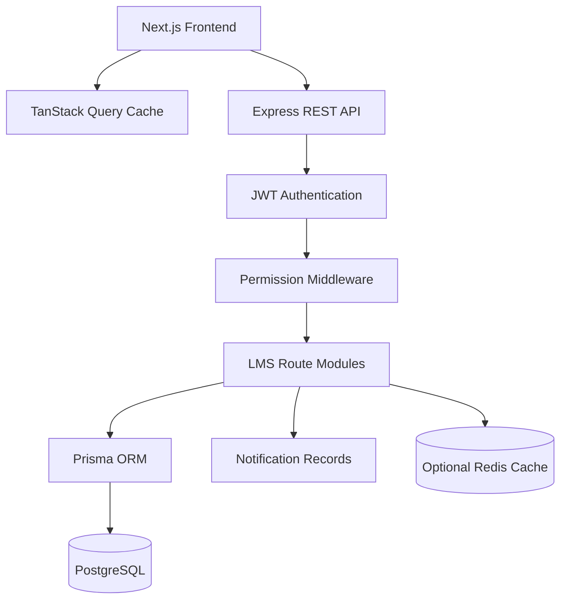

# LMS Implementation Plan And Project Status

## 1. Product Goal

Build a full-stack Leave Management System where organizations can manage employee operations, attendance tracking, and leave requests through a role-based web application with comprehensive reporting capabilities.

The system provides core HR functionalities focused on employee management, attendance, and leave workflows with role-based access control and an intuitive user interface.

## 2. Current User Roles

| Role | Responsibility | Access Level |
| --- | --- | --- |
| Super Admin | System-wide access, user management, and organization-level settings | Full system access |
| HR Admin | Employee management, attendance oversight, leave administration, reports | HR operations access |
| Manager | Team visibility, leave approvals for direct reports | Team-level access |
| Employee | Own profile, attendance clock in/out, leave requests, notifications | Self-service access |

## 3. Current Implementation Status

| Area | Status | Notes |
| --- | --- | --- |
| Project foundation | ✅ Implemented | npm workspaces, Next.js frontend, Express backend, Prisma, Docker PostgreSQL |
| Authentication | ✅ Implemented | Login, register, logout, forgot password, reset password, JWT |
| Authorization | ✅ Implemented | Role and permission based middleware plus protected frontend pages |
| Employee management | ✅ Implemented | Employees, departments, designations, managers, emergency contacts, document metadata |
| Attendance | ✅ Implemented | Clock in/out, work mode, shift settings, holiday management, reports |
| Leave management | ✅ Implemented | Leave types, requests, approvals, rejection, balances, notifications |
| Dashboard | ✅ Implemented | Role-aware summary cards, recent notifications, optional Redis cache |
| Reports | ✅ Implemented | Employee, attendance, leave reports |
| Notifications | ✅ Implemented | In-app notifications, read state |
| Responsive UI | ✅ Implemented | Mobile-friendly navbar/sidebar and responsive pages |
| Smoke validation | ✅ Implemented | Backend smoke test covers key workflows |
| Production hardening | 🔜 Future | CI/CD, deployment, audit logs, email delivery, file storage, monitoring |

## 4. Current Tech Stack

| Layer | Tool | Current Use |
| --- | --- | --- |
| Frontend | Next.js 15, React 19, TypeScript | App Router web application |
| Styling | Tailwind CSS | Responsive dashboard UI |
| Forms | React Hook Form | Form state and validation flows |
| API state | TanStack Query | Fetching, caching, invalidation |
| Icons | Lucide React | UI navigation and actions |
| Animations | Framer Motion | UI transitions and animations |
| Backend | Node.js, Express, TypeScript | REST API server |
| Database | PostgreSQL 16 | Persistent data storage |
| ORM | Prisma | Schema, migrations, typed queries |
| Validation | Zod | Request validation |
| Cache | Redis (optional) | Dashboard summary caching |
| Local infra | Docker Compose | PostgreSQL container |
| Tooling | npm workspaces, ESLint, TypeScript | Build and validation workflow |

## 5. Current System Architecture



## 6. Request Flow

### Standard API Flow

1. User logs in from the frontend
2. Backend validates credentials and returns a JWT
3. Frontend stores the JWT in local storage
4. Protected API requests include `Authorization: Bearer <token>` header
5. Backend authenticates the token via middleware
6. Backend checks required permissions via RBAC middleware
7. Route module executes domain logic
8. Prisma ORM saves or reads data from PostgreSQL
9. API returns a typed JSON response (success or error)
10. Frontend updates TanStack Query cache
11. UI re-renders with updated data

## 7. Implemented Module Details

### Authentication And RBAC

Implemented capabilities:

- Login
- Register
- Logout
- Forgot password
- Reset password
- Current user session
- JWT verification
- Account status checks
- Permission middleware

Primary routes:

```text
POST /api/auth/login
POST /api/auth/register
POST /api/auth/forgot-password
POST /api/auth/reset-password
GET  /api/auth/me
POST /api/auth/logout
```

### Employee Core

Implemented capabilities:

- Employee list, create, detail, update, deactivate
- Department management
- Designation management
- Profile view
- Manager hierarchy
- Emergency contacts
- Employee document metadata

Primary routes:

```text
GET    /api/employees
POST   /api/employees
GET    /api/employees/me
GET    /api/employees/:id
PUT    /api/employees/:id
DELETE /api/employees/:id
GET    /api/departments
POST   /api/departments
GET    /api/designations
POST   /api/designations
POST   /api/employees/:id/documents
```

### Attendance And Time

Implemented capabilities:

- Clock in
- Clock out
- Attendance history
- Attendance report
- Shift setup
- Holiday setup
- Work mode tracking

Primary routes:

```text
POST /api/attendance/clock-in
POST /api/attendance/clock-out
GET  /api/attendance/me
GET  /api/attendance/report
GET  /api/shifts
POST /api/shifts
GET  /api/holidays
POST /api/holidays
```

### Leave Management

Implemented capabilities:

- Leave type setup
- Employee leave request
- Manager/HR approval
- Manager/HR rejection
- Leave balance updates
- Leave history
- Realtime notifications

Primary routes:

```text
POST /api/leaves
GET  /api/leaves
GET  /api/leaves/me
PUT  /api/leaves/:id/approve
PUT  /api/leaves/:id/reject
GET  /api/leaves/balance
GET  /api/leave-types
POST /api/leave-types
```

### Dashboard, Reports, And Notifications

Implemented capabilities:

- Role-aware dashboard summary
- Optional Redis cache for dashboard summary
- Employee report
- Attendance report
- Leave report
- In-app notifications
- Notification read state

Primary routes:

```text
GET  /api/dashboard/summary
GET  /api/reports/employees
GET  /api/reports/attendance
GET  /api/reports/leaves
GET  /api/notifications
PUT  /api/notifications/:id/read
```

## 8. Current Database Entities

```text
User
Role
Permission
UserRole
RolePermission
PasswordResetToken
Employee
Department
Designation
EmergencyContact
EmployeeDocument
Attendance
Shift
Holiday
LeaveType
LeaveRequest
LeaveBalance
Notification
```

## 9. Validation Strategy

Current commands:

```bash
npm run typecheck
npm run lint
npm run build
npm run test:smoke
npm run verify
```

Current smoke test coverage:

- Health endpoint and database connection
- Authentication and unauthenticated rejection
- Employee RBAC checks
- Employee detail and document metadata
- Attendance clock-in and clock-out
- Leave request, approval, and balance update
- Dashboard, notifications, and reports
- Password reset development response
- Validation error behavior

## 10. Current Demo Flow

```text
Admin logs in
-> Admin reviews dashboard with key metrics
-> Admin manages employees, departments, and designations
-> Admin configures shifts, holidays, and leave types
-> Employee logs in and clocks in for attendance
-> Employee applies for leave request
-> Manager or HR approves/rejects leave request
-> Employee receives notification about leave status
-> Employee views leave balance and history
-> Employee clocks out at end of day
-> HR generates reports (employees, attendance, leaves)
```

## 11. Portfolio Highlights

This project demonstrates:

- **Full-stack TypeScript development**: End-to-end type safety from database to UI
- **PostgreSQL relational modeling**: Complex relationships with Prisma ORM
- **Role-based access control**: Permission-based middleware and protected routes
- **Modern React patterns**: Next.js 15 App Router, React 19, TanStack Query
- **RESTful API design**: Clean architecture with modular route organization
- **API validation**: Request/response validation with Zod schemas
- **Responsive UI**: Mobile-friendly design with Tailwind CSS
- **Monorepo structure**: npm workspaces for frontend/backend coordination
- **Docker containerization**: PostgreSQL setup with Docker Compose
- **Testing discipline**: Smoke tests covering critical workflows

## 12. Future Enhancements

### Production Readiness

- [ ] CI/CD pipeline for automated testing and deployment
- [ ] Production deployment configuration (Render, Vercel, Railway, etc.)
- [ ] Structured audit logs for auth and permission-sensitive actions
- [ ] API rate limiting and request logging
- [ ] Observability: health checks, metrics, error tracking
- [ ] Environment-specific configuration management

### Email & Communication

- [ ] Production email delivery for password reset
- [ ] Email notifications for leave approvals/rejections
- [ ] Email notifications for attendance issues
- [ ] Notification preferences per user
- [ ] Email templates with company branding

### File Storage

- [ ] Cloud storage integration (S3, Cloudinary, etc.) for employee documents
- [ ] Secure file upload and download with signed URLs
- [ ] File type validation and size limits
- [ ] Document versioning and history

### Reporting & Analytics

- [ ] Interactive charts for dashboard and reports
- [ ] CSV/PDF export for all reports
- [ ] Advanced filters and date range selectors
- [ ] Saved report views and custom report builder
- [ ] Attendance trends and analytics
- [ ] Leave utilization analytics

### Real-time Features

- [ ] Socket.IO integration for real-time notifications
- [ ] Live dashboard updates
- [ ] Real-time attendance tracking
- [ ] WebSocket connection with Redis adapter for scaling

### Advanced Features

- [ ] Payroll management module
- [ ] Performance review system
- [ ] Recruitment and applicant tracking
- [ ] Employee self-service portal enhancements
- [ ] Mobile app (React Native)
- [ ] AI-powered HR assistant

### Security & Compliance

- [ ] Stronger password policy enforcement
- [ ] Account lockout after failed login attempts
- [ ] Two-factor authentication (2FA)
- [ ] Audit trails for all data modifications
- [ ] GDPR compliance features
- [ ] Data encryption at rest

### Testing

- [ ] Unit tests for critical business logic
- [ ] Integration tests for API endpoints
- [ ] E2E tests for user workflows (Playwright/Cypress)
- [ ] Load testing for performance validation
- [ ] Automated accessibility testing

## 13. Build Priority

Recommended implementation order:

1. **Email delivery** - Critical for password reset and notifications
2. **File storage** - Enable document uploads for employee records
3. **CI/CD pipeline** - Automate testing and deployment
4. **Audit logs** - Track important system changes
5. **Report enhancements** - Charts and export capabilities
6. **Real-time notifications** - Socket.IO for live updates
7. **Production deployment** - Host the application
8. **Advanced modules** - Payroll, performance, recruitment

This order prioritizes production readiness while maintaining the current feature set.